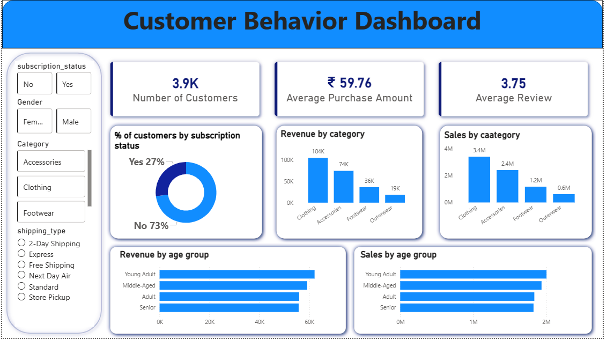

# Customer Shopping Behavior Analysis 🛍️📊

An end-to-end data analytics project leveraging transactional data to uncover critical insights on customer spending patterns, segments, and strategic business growth opportunities.

---

## 📈 Power BI Interactive Dashboards

### 🔗 Live Interactive Report
👉 **[View the Live Interactive Report on Power BI Service](https://app.powerbi.com/reportEmbed?reportId=1b9e64eb-aaa8-47ab-8c43-4fe0df732abd&autoAuth=true&ctid=7f3b4ac6-4c1d-40f9-8601-53cb3f0c6deb)**

*(Note: Depending on your browser's security settings, you can interact with the live report directly inside the iframe below, or click the link above to view it in full screen.)*

<iframe title="customer_behaviora_dashboard" width="100%" height="541.25" src="https://app.powerbi.com/reportEmbed?reportId=1b9e64eb-aaa8-47ab-8c43-4fe0df732abd&autoAuth=true&ctid=7f3b4ac6-4c1d-40f9-8601-53cb3f0c6deb" frameborder="0" allowFullScreen="true"></iframe>

### 📸 Dashboard Static Views

#### Dashboard Overview


#### Detailed Analysis Dashboard


---

## 📖 Project Overview

### Business Problem
A retail company wanted to understand customer shopping behavior to improve sales, satisfaction, and loyalty. Management observed changes in purchasing patterns across demographics, product categories, and channels, and needed data-driven answers.

### Overarching Question
> **"How can the company leverage consumer shopping data to identify trends, improve engagement, and optimize strategy?"**

### Project Deliverables
1. **Data Preparation & EDA:** Preprocessing, cleaning, and feature engineering using Python & Pandas.
2. **SQL Database Integration:** Schema design and SQL analysis on PostgreSQL for 10 core business queries.
3. **Power BI Dashboard:** Interactive reporting dashboard and KPI cards (source file: [customer_behaviora_dashboard.pbix](customer_behaviora_dashboard.pbix)).
4. **Strategic Action Plan:** Recommendations for loyalty programs, subscription growth, and marketing focus.

---

## 📁 Dataset & Exploratory Data Analysis (EDA)

The analysis was performed on a dataset containing **3,900 customer records** and **18 features** covering demographics, purchase history, and behavioral choices.

### Key Feature Groups
* **Demographics:** Age, Gender, Location, Subscription Status
* **Purchase Details:** Item, Category, Amount (USD), Season, Size, Color
* **Shopping Behavior:** Discount Applied, Previous Purchases, Purchase Frequency, Review Rating, Shipping Type

### Preprocessing & EDA Steps (Python)
All data preparation was completed in [customer_shopping_behavior.ipynb](customer_shopping_behavior.ipynb):
* **Data Loading & Structure Inspection:** Explored dataframe using `.info()` and `.describe(include='all')`.
* **Missing Value Imputation:** Imputed missing values in `Review Rating` (37 missing records) using the **median rating of their respective product categories** to preserve category-specific rating distributions.
* **Standardization:** Converted all column names to standard `snake_case` (e.g. `purchase_amount_(usd)` renamed to `purchase_amount`).
* **Feature Engineering:**
  * Created `age_group` column using quantile binning (bins: **Young Adult (18-31)**, **Adult (32-44)**, **Middle-Aged (45-57)**, and **Senior (58-70)**).
  * Mapped categorical purchase frequencies into numeric values in days (`purchase_frequency_days`), e.g., Weekly = 7, Fortnightly = 14, Monthly = 30, Annually = 365.
* **Consistency Check:** Dropped `promo_code_used` after confirming it was perfectly collinear (100% matched) with `discount_applied`.
* **SQL Upload:** Loaded the final cleaned and preprocessed dataframe into a local PostgreSQL database using `sqlalchemy`.

---

## 💻 SQL Analysis (Business Transactions)

The preprocessed data was queried in PostgreSQL to extract business-critical findings. All queries are documented in [queries.sql](queries.sql).

### Key Insights & SQL Implementation

#### 1. Revenue by Gender
* **Insight:** Male customers generated significantly higher total revenue compared to Female customers.
* **Result:** Male: **₹1,57,890** | Female: **₹75,191**
```sql
SELECT gender, SUM(purchase_amount) AS total_revenue
FROM customer_behavior
GROUP BY gender
ORDER BY total_revenue DESC;
```

#### 2. High-Spend Discount Users
* **Insight:** There are **839** customers who used a discount code yet still spent more than the overall average purchase amount (₹59.76).
```sql
SELECT COUNT(*) AS high_spend_discount_users
FROM customer_behavior
WHERE discount_applied = 'Yes'
  AND purchase_amount > (SELECT AVG(purchase_amount) FROM customer_behavior);
```

#### 3. Top 5 Products by Rating
* **Insight:** Gloves, Sandals, and Boots occupy the highest-rated product categories.
* **Result:** Gloves (**3.86**) • Sandals (**3.84**) • Boots (**3.82**) • Hat (**3.80**) • Skirt (**3.78**)
```sql
SELECT item_purchased, ROUND(AVG(review_rating)::numeric, 2) AS avg_rating
FROM customer_behavior
GROUP BY item_purchased
ORDER BY avg_rating DESC
LIMIT 5;
```

#### 4. Shipping Type Impact on Order Values
* **Insight:** Express and Next Day Air methods see slightly higher average order amounts.
* **Result:** Standard: **₹58.46 avg** | Express: **₹60.48 avg**
```sql
SELECT shipping_type, ROUND(AVG(purchase_amount)::numeric, 2) AS avg_purchase_amount
FROM customer_behavior
GROUP BY shipping_type
ORDER BY avg_purchase_amount DESC;
```

#### 5. Subscribers vs Non-Subscribers Spend
* **Insight:** Out of 3,900 customers, only **1,053 are subscribers** (27%). However, their average purchase amount is very similar to non-subscribers (₹59.49 vs ₹59.87).
```sql
SELECT subscription_status, COUNT(*) AS customer_count, ROUND(AVG(purchase_amount)::numeric, 2) AS avg_purchase_amount
FROM customer_behavior
GROUP BY subscription_status;
```

#### 6. Discount-Dependent Products
* **Insight:** Items like Hats (50.0%) and Sneakers (49.7%) have the highest percentage of sales relying on discounts.
```sql
SELECT item_purchased,
       COUNT(CASE WHEN discount_applied = 'Yes' THEN 1 END) AS discount_purchases,
       COUNT(*) AS total_purchases,
       ROUND((COUNT(CASE WHEN discount_applied = 'Yes' THEN 1 END) * 100.0 / COUNT(*))::numeric, 1) AS discount_percentage
FROM customer_behavior
GROUP BY item_purchased
ORDER BY discount_percentage DESC;
```

#### 7. Customer Loyalty Segmentation
* **Insight:** Segmented customers based on previous transactions.
* **Result:** **Loyal** (>10 purchases): **3,116** | **Returning** (2-10 purchases): **701** | **New** (<=1 purchase): **83**
```sql
SELECT
  CASE
    WHEN previous_purchases <= 1 THEN 'New'
    WHEN previous_purchases BETWEEN 2 AND 10 THEN 'Returning'
    ELSE 'Loyal'
  END AS customer_segment,
  COUNT(*) AS customer_count
FROM customer_behavior
GROUP BY customer_segment
ORDER BY customer_count ASC;
```

#### 8. Top 3 Revenue-Generating Products per Category
* **Accessories:** Jewelry, Sunglasses, Belt
* **Clothing:** Blouse, Pants, Shirt
```sql
WITH ranked_products AS (
  SELECT category, item_purchased, SUM(purchase_amount) AS revenue,
         ROW_NUMBER() OVER(PARTITION BY category ORDER BY SUM(purchase_amount) DESC) AS rank
  FROM customer_behavior
  GROUP BY category, item_purchased
)
SELECT category, item_purchased, revenue
FROM ranked_products
WHERE rank <= 3;
```

#### 9. Repeat Buyers (>5 Purchases) by Subscription
* **Result:** **2,518 non-subscribers** vs **958 subscribers** among repeat purchasers.
```sql
SELECT subscription_status, COUNT(*) AS repeat_buyers_count
FROM customer_behavior
WHERE previous_purchases > 5
GROUP BY subscription_status;
```

#### 10. Revenue by Age Group
* **Result:** Young Adult: **₹62,143** | Middle-Aged: **₹59,197** | Adult: **₹55,978** | Senior: **₹55,763**
```sql
SELECT
  CASE
    WHEN age BETWEEN 18 AND 31 THEN 'Young Adult'
    WHEN age BETWEEN 32 AND 44 THEN 'Adult'
    WHEN age BETWEEN 45 AND 57 THEN 'Middle-Aged'
    ELSE 'Senior'
  END AS age_segment,
  SUM(purchase_amount) AS total_revenue
FROM customer_behavior
GROUP BY age_segment
ORDER BY total_revenue DESC;
```

---

## 🎯 Business Recommendations & Action Plan

1. **🚀 Boost Subscription Conversion:** 
   Only 27% of customers subscribe, despite subscribers and non-subscribers having almost identical average spends. Introduce a loyalty-tier model with exclusive member discounts, free express shipping, or points multipliers to incentivize subscriptions.
2. **💎 Expand Customer Loyalty Programs:**
   80% of customers are already classified as "Loyal". Double-down on retention rewards to keep them engaged, and target the "Returning" tier (701 customers) with milestone discounts to push them into the "Loyal" group.
3. **⚖️ Optimize Discount Policy:**
   Approximately 50% of Hat and Sneaker purchases are discount-dependent. Balance promotional pricing with margin protection by bundles (e.g., "buy two get 20% off accessories") instead of flat discounts on single items.
4. **🎯 Target Young Adults & Express Shoppers:**
   Young adults generate the highest segment revenue (₹62K). Optimize social media campaigns focusing on accessories and footwear for this group. Since Express-shipping users have a higher average spend (₹60.48 vs ₹58.46 standard), promote free express shipping triggers (e.g., "Free Express Shipping on orders above ₹80") to increase average order values.
5. **🛍️ Strategic Product Bundling:**
   Highlight top-rated products (Gloves, Sandals, Boots) alongside popular volume drivers (Jewelry, Blouse, Shirt) in product recommendation blocks on the e-commerce store.

---

## 🛠️ Stack & Technologies Used
* **Python:** Data Cleaning, Group Imputations, Column Normalization, and Feature Engineering.
* **Libraries:** `pandas`, `sqlalchemy`, `psycopg2-binary`.
* **PostgreSQL Database:** Data Storage & Advanced querying.
* **Power BI:** Interactive dashboard design, slicers, and KPI cards (source file included: [customer_behaviora_dashboard.pbix](customer_behaviora_dashboard.pbix)).
